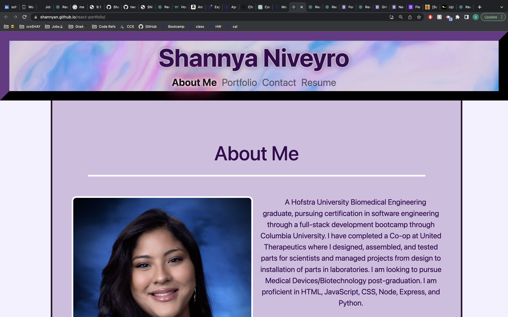
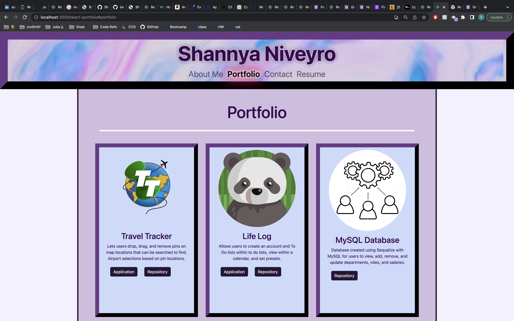
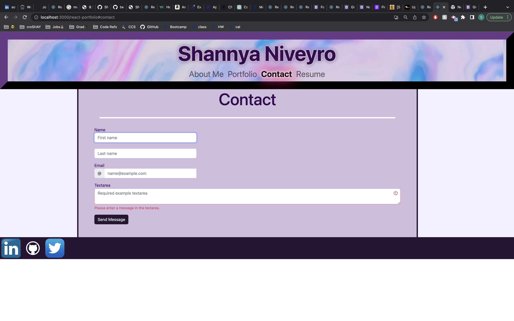
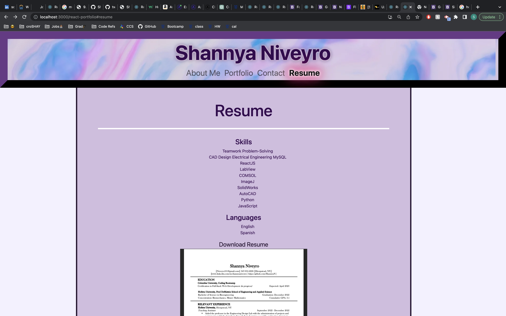

# Portfolio (React)  
  
 # Table of Contents  
   
1. [Description](#description)  
2. [Installation](#installation)  
3. [Usage](#usage)   
4. [Contributions](#contributions)    
5. [Questions](#questions)  
6. [Screenshots](#screenshots)  
7. [Links](#links)  
## Description  
Software Developer Portfolio made using React with sections for About Me, Portfolio items or past projects, a contact form, and Resume.  
  
## Installation  
Must run an npm i to access the software libraries and packages and libraries used in development. Nothing needed to view the the deployed site.   
  
## Usage  
If an employer were interested in hiring, they could view this profile to get a sense of who I am as a person and developer.  
  
## Contributions  
no   
   
## Questions  
Take a closer look at this repo and my other work by visiting my GitHub with the link below, or contact me directly by email.  
GitHub: https://github.com/ShannyaNShannyaN  
Email: niveyro101@gmail.comniveyro101@gmail.com  
## Screenshots  
 
 
 
 

## Links  
Deployed site: https://shannyan.github.io/react-portfolio/  
Repository: https://github.com/ShannyaN/react-portfolio